# 🎭 The Grand Supabase Refactoring Spectacular
*A Whimsical Implementation Plan for Direct SDK to Edge Functions Migration*

## 🎪 The Show Must Go On!

Welcome, dear digital architects, to our magnificent transformation! We're about to perform the most dazzling refactoring act this side of the internet - converting our humble direct Supabase SDK calls into a glorious Edge Functions symphony!

## 🎨 Architecture Overview

```mermaid
flowchart TD
    subgraph Frontend[🎭 The Performance Stage]
        AudioStep[🎵 AudioStep Component]
        usePostData[🪝 usePostData Hook]
        ClientSDK[🎪 Client SDK Wrapper]
    end
    
    subgraph APIRoutes[🚪 The Gateway Guardians]
        AudioJobsAPI[🎼 Audio Jobs Proxy]
        MediaAssetsAPI[🖼️ Media Assets Proxy]
        PostsAPI[📝 Posts Proxy]
    end
    
    subgraph EdgeFunctions[⚡ The Cloud Conjurers]
        AudioJobsEF[🎵 Audio Jobs Edge Function]
        MediaAssetsEF[🖼️ Media Assets Edge Function]
        PostsEF[📝 Posts Edge Function]
    end
    
    subgraph Database[🏛️ The Data Palace]
        AudioJobsTable[🎵 Audio Jobs Table]
        MediaAssetsTable[🖼️ Media Assets Table]
        PostsTable[📝 Posts Table]
        Cache[🧠 Memory Palace]
    end
    
    AudioStep --> ClientSDK
    usePostData --> ClientSDK
    ClientSDK --> AudioJobsAPI
    ClientSDK --> MediaAssetsAPI
    ClientSDK --> PostsAPI
    
    AudioJobsAPI --> AudioJobsEF
    MediaAssetsAPI --> MediaAssetsEF
    PostsAPI --> PostsEF
    
    AudioJobsEF --> AudioJobsTable
    AudioJobsEF --> Cache
    MediaAssetsEF --> MediaAssetsTable
    MediaAssetsEF --> Cache
    PostsEF --> PostsTable
    PostsEF --> Cache
```



## 🎯 Our Grand Performance Plan

### Act I: The Foundation Setting

#### 🎪 **Step 1: Summon the OpenAPI Specifications**
*Before Prisma can dance, the API must sing its song!*

Create our magical API contracts in `config/openapi/openapi.yaml`:

**Audio Jobs Endpoints** 🎵
```yaml
# The melodic endpoints for our audio adventures
/functions/v1/audio-jobs:
  get: # List all our musical creations
  post: # Birth a new audio job
/functions/v1/audio-jobs/{id}:
  get: # Inspect a specific audio masterpiece
  put: # Polish and perfect
  delete: # Send to the digital afterlife
/functions/v1/audio-jobs/{id}/process:
  post: # Let the magic begin!
/functions/v1/audio-jobs/{id}/cancel:
  post: # Stop the show (gracefully)
```

**Media Assets Endpoints** 🖼️
```yaml
# The gallery of our digital treasures
/functions/v1/media-assets:
  get: # Browse the collection
  post: # Add to our gallery
/functions/v1/media-assets/{id}:
  get: # Admire a specific piece
  put: # Restore and enhance
  delete: # Remove from exhibition
```

**Enhanced Posts Endpoints** 📝
```yaml
# Weaving audio into our storytelling
/functions/v1/posts/{id}/audio-assets:
  get: # What sounds does this story make?
  post: # Add a soundtrack!
/functions/v1/posts/{id}/primary-audio:
  put: # Crown the main melody
```

#### 🎭 **Step 2: Conjure Prisma for Type Generation**
*Now that our API contract is written, let Prisma read the fine print!*

- Install the mystical Prisma dependencies
- Configure Prisma to consume our OpenAPI scrolls
- Generate TypeScript types that would make Shakespeare weep with joy

### Act II: The Edge Functions Spectacular

#### ⚡ **Step 3: Craft the Edge Function Trinity**

**The Audio Jobs Conductor** 🎼
```typescript
// supabase/functions/audio-jobs/index.ts
// Where audio dreams become reality!
```

**The Media Assets Curator** 🖼️
```typescript
// supabase/functions/media-assets/index.ts
// Guardian of all things beautiful and multimedia
```

**The Enhanced Posts Storyteller** 📝
```typescript
// supabase/functions/posts/index.ts (enhanced)
// Now with 50% more audio magic!
```

### Act III: The API Gateway Ballet

#### 🚪 **Step 4: Build the Proxy Gateways**

Create elegant API route proxies that dance between frontend and Edge Functions:

```
src/app/api/audio-jobs/route.ts          # The main stage
src/app/api/audio-jobs/[id]/route.ts     # The spotlight
src/app/api/media-assets/route.ts        # The gallery entrance
src/app/api/media-assets/[id]/route.ts   # The exhibition room
```

### Act IV: The Client SDK Transformation

#### 🎪 **Step 5: Weave the Client SDK Magic**

Create a delightfully type-safe client SDK at `src/lib/api/client.ts`:

```typescript
// The ringmaster that coordinates all our API circus acts
class APIClient {
  audioJobs: AudioJobsAPI;    // 🎵 The melody maker
  mediaAssets: MediaAssetsAPI; // 🖼️ The art dealer  
  posts: PostsAPI;            // 📝 The storyteller
}
```

### Act V: The Component Makeover

#### 🎭 **Step 6: Transform Our Star Performers**

**The usePostData Hook Renovation** 🪝
- Teach it to speak fluent API instead of direct SDK
- Keep the same charming personality, just with better manners

**The AudioStep Component Upgrade** 🎵
- Give it the new API architecture superpowers
- Maintain its delightful user experience

## 🎨 Error Handling: Our Safety Net

Every great circus needs a safety net! Our consistent error pattern:

```typescript
interface ErrorResponse {
  error: {
    code: string;        // "AUDIO_JOB_ESCAPED" 🎪
    message: string;     // "The audio job has run away to join another circus"
    details?: any;       // The juicy gossip
    status: number;      // HTTP status (the crowd's reaction)
    timestamp: string;   // When the drama happened
    requestId?: string;  // For our detective work
  }
}
```

## 🚀 Performance Magic Tricks

To keep our audio generation workflow zippy:

- **Caching Spells** 🧠: Store frequently accessed treasures
- **Chunked Processing** ⚡: Break big tasks into digestible bites
- **Background Wizardry** 🎭: Let long tasks perform off-stage
- **Progress Updates** 📊: Keep the audience entertained
- **Retry Resilience** 🔄: If at first you don't succeed...

## 📋 The Grand Checklist

- [ ] **Create OpenAPI specifications** - Write the sacred API contracts
- [ ] **Set up Prisma for type generation** - Summon the type wizard
- [ ] **Generate TypeScript types** - Let Prisma work its magic
- [ ] **Create Audio Jobs Edge Function** - Birth the audio conductor
- [ ] **Create Media Assets Edge Function** - Summon the asset curator
- [ ] **Enhance Posts Edge Function** - Give posts their audio superpowers
- [ ] **Build API route proxies** - Construct the gateway bridges
- [ ] **Create Client SDK wrapper** - Weave the coordination magic
- [ ] **Refactor usePostData hook** - Teach old hooks new tricks
- [ ] **Update AudioStep component** - Give it the new architecture
- [ ] **Create comprehensive tests** - Deploy our quality assurance sprites
- [ ] **Update documentation** - Chronicle our magnificent transformation

## 🎉 The Grand Finale

When our performance is complete, we'll have:

- **Consistency** 🎯: All database operations through Edge Functions
- **Type Safety** 🛡️: Generated types ensuring harmony
- **Maintainability** 🔧: Clear separation of digital concerns
- **Scalability** 📈: Edge Functions that grow with our dreams
- **Security** 🔐: Sensitive operations safely tucked away
- **Performance** ⚡: Cached and optimized for audio generation
- **Documentation** 📚: OpenAPI specs as our living documentation

*Let the refactoring spectacular begin!* 🎪✨