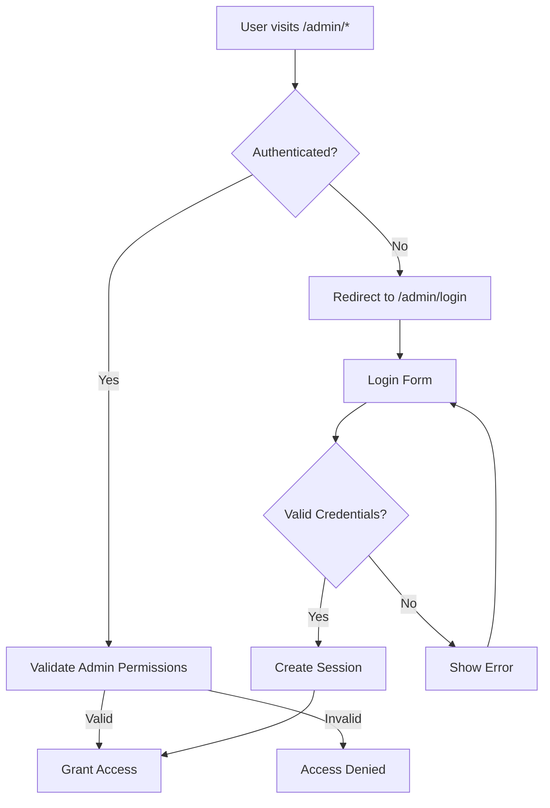

# 🎭 Artful Archives Admin Authentication System

## Overview

The Artful Archives admin authentication system provides comprehensive user management, role-based access control, and secure authentication flows for the administrative panel.

## 🔐 Authentication Methods

### 1. Session-Based Authentication (Admin Panel)
- **Purpose**: Human admin users accessing the web interface
- **Implementation**: Supabase Auth with persistent sessions
- **Redirect**: Unauthenticated users → `/admin/login`
- **Persistence**: Sessions maintained via Supabase cookies

### 2. API Key Authentication (ChatGPT Actions)
- **Purpose**: External integrations and automated systems
- **Implementation**: Custom API key validation
- **Bypass**: Uses service client for database operations
- **Security**: Environment-based key validation

### 3. Service Role Authentication (Internal Operations)
- **Purpose**: Background jobs and admin API operations
- **Implementation**: `SUPABASE_SERVICE_ROLE_KEY` bypasses RLS
- **Usage**: Internal admin operations and automated tasks

## 👥 User Roles & Permissions

### Role Hierarchy
```typescript
type AdminRole = 'user' | 'admin' | 'super_admin'
```

### Permissions by Role

| Permission | User | Admin | Super Admin |
|------------|------|-------|-------------|
| View own profile | ✅ | ✅ | ✅ |
| Edit own profile | ✅ | ✅ | ✅ |
| View admin panel | ❌ | ✅ | ✅ |
| Manage posts | ❌ | ✅ | ✅ |
| Manage users | ❌ | ❌ | ✅ |
| System settings | ❌ | ❌ | ✅ |
| Delete users | ❌ | ❌ | ✅ |

## 🛠️ Admin User Management

### Creating Admin Users

#### Method 1: Interactive CLI Script
```bash
# Interactive mode
node scripts/create-admin-user.js

# Quick creation
node scripts/create-admin-user.js admin@artfularchives.com super_admin "John" "Doe"
```

#### Method 2: Programmatic Creation
```typescript
import { adminAuthService } from '@/lib/admin/auth-service'

const newUser = await adminAuthService.getOrCreateServiceUser('admin@example.com')
```

### Managing User Roles
```typescript
// Update user role
await adminAuthService.updateUserRole(userId, 'super_admin')

// Validate permissions
const hasPermission = await adminAuthService.validateAdminPermissions(userId, 'admin')
```

## 🔧 Service User Setup

### Creating a Service User
```bash
node scripts/create-admin-user.js service@artfularchives.com super_admin "Service" "Account"
```

### Service User Benefits
- **RLS Bypass**: Direct database access for admin operations
- **API Operations**: Seamless integration with admin endpoints
- **Background Tasks**: Perfect for automated workflows
- **Security**: Isolated account for system operations

## 🏗️ System Architecture

### Core Components

#### 1. AdminAuthService (`/lib/admin/auth-service.ts`)
```typescript
class AdminAuthService {
  // User management
  getOrCreateServiceUser()
  validateAdminPermissions()
  getAllAdminUsers()
  updateUserRole()

  // Session management
  logoutAdmin()
}
```

#### 2. AuthStateManager
```typescript
class AuthStateManager {
  // Reactive state management
  subscribe()
  initialize()
  logout()

  // State access
  getState()
}
```

#### 3. Protected Layout (`/admin/(protected)/layout.tsx`)
- Automatic redirect for unauthenticated users
- E2E bypass for testing
- Admin permission validation

### Authentication Flow



## 🔑 API Key Authentication

### Setup
```bash
# Environment variable
CHATGPT_ACTIONS_API_KEY=your-secure-api-key-here
```

### Usage
```typescript
// In API routes
const authResult = await authenticateRequest(request)
if (authResult.authType === 'api_key') {
  // Use service client for operations
  const supabase = authResult.supabaseClient
}
```

## 🧪 Testing Authentication

### E2E Bypass for Testing
```typescript
// Add to request headers
'x-e2e-bypass': 'test-bypass'
```

### Environment Setup
```bash
# For testing
E2E_BYPASS_TOKEN=test-bypass

# For production (leave undefined)
E2E_BYPASS_TOKEN=
```

## 📊 Admin User Management Dashboard

### Features
- ✅ View all admin users
- ✅ Role management (admin ↔ super_admin)
- ✅ User creation (via CLI for security)
- ✅ Activity monitoring
- ✅ Permission validation

### Dashboard Location
- **URL**: `/admin/users`
- **Component**: `AdminUserManager`
- **Permissions**: Super Admin only

## 🔒 Security Best Practices

### 1. Password Policies
- Minimum 12 characters
- Mixed case, numbers, symbols
- No common passwords
- Regular rotation recommended

### 2. Session Management
- Automatic session refresh
- Secure cookie settings
- Session timeout after inactivity
- Logout on suspicious activity

### 3. API Key Security
- Rotate keys regularly
- Use environment variables
- Never commit to version control
- Limit key permissions

### 4. Service Role Usage
- Only for internal operations
- Never expose to client-side code
- Monitor usage patterns
- Regular security audits

## 🚨 Troubleshooting

### Common Issues

#### 1. "Access Denied" After Login
```typescript
// Check user permissions
const hasPermission = await adminAuthService.validateAdminPermissions(userId)
console.log('User permissions:', hasPermission)
```

#### 2. Session Not Persisting
```typescript
// Check Supabase configuration
console.log('Supabase URL:', process.env.NEXT_PUBLIC_SUPABASE_URL)
console.log('Supabase Key:', process.env.NEXT_PUBLIC_SUPABASE_ANON_KEY?.substring(0, 10) + '...')
```

#### 3. API Key Not Working
```typescript
// Validate API key
const validKey = process.env.CHATGPT_ACTIONS_API_KEY
console.log('API Key configured:', !!validKey)
```

### Debug Commands
```bash
# List all admin users
node scripts/create-admin-user.js

# Check environment variables
echo $SUPABASE_SERVICE_ROLE_KEY | head -c 20

# Test authentication
curl -H "Authorization: Bearer your-api-key" http://localhost:3000/api/admin/test
```

## 📈 Monitoring & Logging

### Authentication Events
- Login attempts (success/failure)
- Permission validation
- Role changes
- Session creation/destruction

### Security Monitoring
- Failed login attempts
- Suspicious activity
- API key usage
- Service role operations

## 🎯 Best Practices

### For Developers
1. Always validate permissions before admin operations
2. Use service client for background tasks
3. Implement proper error handling
4. Log authentication events
5. Regular security reviews

### For Administrators
1. Use strong, unique passwords
2. Enable two-factor authentication when available
3. Regularly review user access
4. Monitor authentication logs
5. Follow principle of least privilege

## 🔄 Migration & Updates

### Adding New Roles
```sql
-- Add new role to enum
ALTER TYPE admin_role ADD VALUE 'moderator';

-- Update permission checks
-- Modify validateAdminPermissions function
```

### Database Schema Updates
```sql
-- Add new permission fields
ALTER TABLE admin_profiles
ADD COLUMN can_delete_users BOOLEAN DEFAULT false;

-- Update existing users
UPDATE admin_profiles
SET can_delete_users = true
WHERE role = 'super_admin';
```

---

## 🎭 Quick Start Guide

### 1. Create Your First Admin User
```bash
node scripts/create-admin-user.js admin@yourdomain.com super_admin "Your" "Name"
```

### 2. Access Admin Panel
```
http://localhost:3000/admin/login
```

### 3. Create Service User (Optional)
```bash
node scripts/create-admin-user.js service@artfularchives.com super_admin "Service" "Account"
```

### 4. Configure API Keys
```bash
# .env
CHATGPT_ACTIONS_API_KEY=your-chatgpt-key
SUPABASE_SERVICE_ROLE_KEY=your-service-key
```

## 📞 Support

For authentication issues:
1. Check the browser console for errors
2. Verify environment variables are set
3. Review Supabase dashboard for user status
4. Check application logs for authentication events

---

*🎨 This authentication system ensures the Artful Archives admin panel remains secure while providing flexible access for different use cases and user types.*
