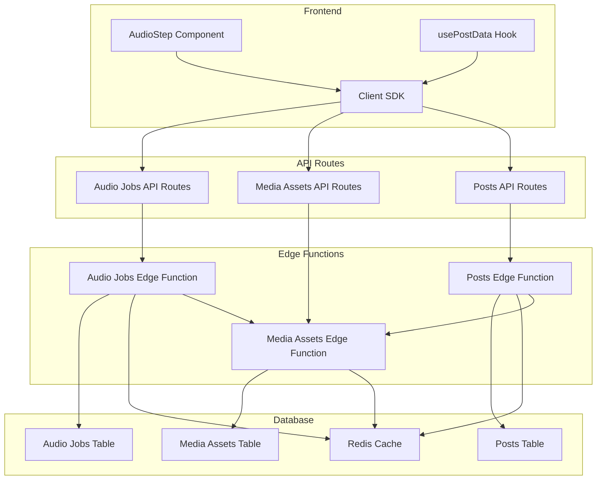

# Implementation Plan for Refactoring Direct Supabase SDK Calls to Edge Functions

Based on my analysis of the codebase and your requirements, I've created a comprehensive implementation plan for refactoring the direct Supabase SDK calls to use Edge Functions. The plan follows RESTful API design principles, includes consistent error handling with detailed error codes and messages, and ensures the audio generation workflow remains performant with proper caching.

## Architecture Overview



## Implementation Details

### 1. RESTful API Design Principles

The OpenAPI specifications will follow these RESTful principles:

- **Resource-oriented endpoints**: Each endpoint represents a resource (audio jobs, media assets, posts)
- **HTTP methods for CRUD operations**: GET, POST, PUT, DELETE
- **Consistent URL structure**: `/functions/v1/resource/{id}`
- **Query parameters for filtering**: `?status=pending&limit=10`
- **Proper status codes**: 200 OK, 201 Created, 400 Bad Request, 401 Unauthorized, 404 Not Found, 500 Internal Server Error
- **Hypermedia links**: Include links to related resources

### 2. Error Handling Pattern

All Edge Functions will implement a consistent error handling pattern:

```typescript
interface ErrorResponse {
  error: {
    code: string;        // Machine-readable error code (e.g., "AUDIO_JOB_NOT_FOUND")
    message: string;     // Human-readable error message
    details?: any;       // Optional additional details
    status: number;      // HTTP status code
    timestamp: string;   // ISO timestamp of when the error occurred
    requestId?: string;  // For tracking errors across systems
  }
}
```

Common error codes will be defined in a shared library to ensure consistency.

### 3. Performance Considerations for Audio Generation

To ensure the audio generation workflow remains performant:

- **Caching**: Implement caching for frequently accessed resources
- **Chunked processing**: Process audio in chunks to avoid timeouts
- **Background processing**: Use background workers for long-running tasks
- **Progress tracking**: Provide real-time progress updates
- **Retry mechanisms**: Implement retry logic for failed operations

### 4. Detailed Implementation Steps

#### 4.1 Set up Prisma in the project for type generation

- Install Prisma CLI and dependencies
- Create a Prisma configuration file
- Configure Prisma to generate types from OpenAPI specifications

#### 4.2 Create OpenAPI specifications for audio jobs endpoints

Add the following endpoints to `config/openapi/openapi.yaml`:

```yaml
/functions/v1/audio-jobs:
  get:
    operationId: listAudioJobs
    summary: List audio jobs
    # Parameters, responses, etc.
  post:
    operationId: createAudioJob
    summary: Create a new audio job
    # Request body, responses, etc.

/functions/v1/audio-jobs/{id}:
  get:
    operationId: getAudioJob
    summary: Get a specific audio job
    # Parameters, responses, etc.
  put:
    operationId: updateAudioJob
    summary: Update an audio job
    # Parameters, request body, responses, etc.
  delete:
    operationId: deleteAudioJob
    summary: Delete an audio job
    # Parameters, responses, etc.

/functions/v1/audio-jobs/{id}/process:
  post:
    operationId: processAudioJob
    summary: Process an audio job
    # Parameters, responses, etc.

/functions/v1/audio-jobs/{id}/cancel:
  post:
    operationId: cancelAudioJob
    summary: Cancel an audio job
    # Parameters, responses, etc.
```

Define schemas for:
- `AudioJob`: Full audio job object
- `NewAudioJob`: Object for creating a job
- `UpdateAudioJob`: Object for updating a job
- `AudioJobStatus`: Enum of possible statuses

#### 4.3 Create OpenAPI specifications for media assets endpoints

Add the following endpoints to `config/openapi/openapi.yaml`:

```yaml
/functions/v1/media-assets:
  get:
    operationId: listMediaAssets
    summary: List media assets
    # Parameters, responses, etc.
  post:
    operationId: createMediaAsset
    summary: Create a new media asset
    # Request body, responses, etc.

/functions/v1/media-assets/{id}:
  get:
    operationId: getMediaAsset
    summary: Get a specific media asset
    # Parameters, responses, etc.
  put:
    operationId: updateMediaAsset
    summary: Update a media asset
    # Parameters, request body, responses, etc.
  delete:
    operationId: deleteMediaAsset
    summary: Delete a media asset
    # Parameters, responses, etc.

/functions/v1/media-assets/{id}/link:
  post:
    operationId: linkMediaAsset
    summary: Link a media asset to a post
    # Parameters, request body, responses, etc.
```

Define schemas for:
- `MediaAsset`: Full media asset object
- `NewMediaAsset`: Object for creating an asset
- `UpdateMediaAsset`: Object for updating an asset
- `MediaAssetType`: Enum of possible types (audio, image, etc.)

#### 4.4 Update existing posts OpenAPI spec to include audio-related operations

Add the following endpoints to the existing posts section:

```yaml
/functions/v1/posts/{id}/audio-assets:
  get:
    operationId: getPostAudioAssets
    summary: Get audio assets for a post
    # Parameters, responses, etc.
  post:
    operationId: addPostAudioAsset
    summary: Add an audio asset to a post
    # Parameters, request body, responses, etc.

/functions/v1/posts/{id}/primary-audio:
  put:
    operationId: setPostPrimaryAudio
    summary: Set the primary audio for a post
    # Parameters, request body, responses, etc.
```

#### 4.5 Generate TypeScript types from the OpenAPI specs using Prisma

Configure Prisma to generate types from the OpenAPI specs and run the generation command.

#### 4.6 Create a new Supabase Edge Function for audio job management

Create the Edge Function at `supabase/functions/audio-jobs/index.ts` with the following functionality:

- CRUD operations for audio jobs
- Processing logic for audio generation
- Multilingual support
- Integration with OpenAI TTS API
- Error handling and logging
- Caching for improved performance

#### 4.7 Create a new Supabase Edge Function for media assets management

Create the Edge Function at `supabase/functions/media-assets/index.ts` with the following functionality:

- CRUD operations for media assets
- Storage operations for audio files
- Linking media assets to posts
- Error handling and logging
- Caching for improved performance

#### 4.8 Enhance the existing posts Edge Function to include audio-related operations

Update the posts Edge Function to include:

- Retrieving audio assets for a post
- Adding audio assets to a post
- Setting the primary audio for a post
- Handling audio-related metadata

#### 4.9 Create API route proxies for audio job operations

Create the following API routes:

- `src/app/api/audio-jobs/route.ts`: CRUD operations for audio jobs
- `src/app/api/audio-jobs/[id]/route.ts`: Operations on a specific job
- `src/app/api/audio-jobs/[id]/process/route.ts`: Process a job
- `src/app/api/audio-jobs/[id]/cancel/route.ts`: Cancel a job

Each route should proxy requests to the corresponding Edge Function.

#### 4.10 Create API route proxies for media asset operations

Create the following API routes:

- `src/app/api/media-assets/route.ts`: CRUD operations for media assets
- `src/app/api/media-assets/[id]/route.ts`: Operations on a specific asset
- `src/app/api/media-assets/[id]/link/route.ts`: Link an asset to a post

Each route should proxy requests to the corresponding Edge Function.

#### 4.11 Create a client SDK wrapper for Edge Functions

Create a client SDK at `src/lib/api/client.ts` with:

- Type-safe methods for all API operations
- Consistent error handling
- Authentication handling
- Request/response logging
- Caching for improved performance

The SDK should include modules for:
- Posts API
- Audio Jobs API
- Media Assets API

#### 4.12 Refactor the usePostData hook to use API routes

Update `src/hooks/usePostData.ts` to:

- Use the client SDK instead of direct Supabase calls
- Handle audio-related operations through the API
- Maintain the same interface for components

#### 4.13 Update the AudioStep component to use the new API architecture

Modify `src/components/admin/wizard/AudioStep.tsx` to:

- Use the client SDK for audio generation
- Handle audio job status updates
- Maintain the same user experience

#### 4.14 Create tests to verify the new architecture

Create unit tests for:
- Client SDK functions
- API route proxies
- Edge Functions

Create integration tests for:
- Audio generation workflow
- Media asset management

#### 4.15 Update documentation to reflect the architectural changes

Update documentation to explain:
- The new architecture
- How to use the client SDK
- How to extend the API

## Benefits of the New Architecture

1. **Consistency**: All database operations will go through Edge Functions
2. **Type Safety**: Generated types will ensure type safety across the stack
3. **Maintainability**: Clear separation of concerns between frontend and backend
4. **Scalability**: Edge Functions can be scaled independently
5. **Security**: Improved security by moving sensitive operations to Edge Functions
6. **Documentation**: OpenAPI specs serve as documentation for the API
7. **Performance**: Caching and optimized processing for audio generation


Checklist:

The user wants me to create a markdown file for the plan and then start implementing the first step. I also need to ensure that all documentation and comments are light, theatrical, whimsical, and cheeky.

The first step in the `update_todo_list` is "Set up Prisma in the project for type generation".

Here's the plan:
1.  **Create the plan markdown file**: I'll use the `write_file` tool to create a `plan.md` file and populate it with the current todo list, formatted as a markdown checklist. I'll also add some whimsical introductory text as requested by the user.
2.  **Start with Prisma setup**: After creating the `plan.md`, I will proceed with the first item in the todo list: "Set up Prisma in the project for type generation". This will involve:
    *   Installing Prisma.
    *   Initializing Prisma.
    *   Configuring the `schema.prisma` file.
    *   Generating types.
    *   Adding whimsical comments and documentation throughout the process.


# Our Grand Redesign: A Whimsical Blueprint for a Supabase-Powered Future! ✨

Hark, fellow adventurers in the digital realm! Herein lies the grand tapestry of our undertaking, a meticulously crafted plan to weave magic into our audio generation workflow. Each checkbox is a star in our constellation, guiding us toward a more robust and enchanting architecture.

## The Grand To-Do List:

- [ ] **Set up Prisma in the project for type generation**: Let us summon Prisma, the mystical scribe, to conjure our data types with grace and precision.
- [ ] **Create OpenAPI specifications for audio jobs endpoints in config/openapi/openapi.yaml**: We shall pen the sacred scrolls for our audio jobs, detailing their every whisper and command.
- [ ] **Create OpenAPI specifications for media assets endpoints in config/openapi/openapi.yaml**: Similarly, we shall document the secrets of our media assets, ensuring clarity in their digital dance.
- [ ] **Update existing posts OpenAPI spec to include audio-related operations**: Let us weave the tales of audio into the existing chronicles of our posts.
- [ ] **Generate TypeScript types from the OpenAPI specs using Prisma**: With our scrolls complete, Prisma shall breathe life into them, creating TypeScript spells for our code.
- [ ] **Create a new Supabase Edge Function for audio job management (audio-jobs)**: A new guardian for our audio tasks shall be summoned, residing within Supabase's ethereal functions.
- [ ] **Create a new Supabase Edge Function for media assets management (media-assets)**: Another guardian, this one for our precious media assets, will be brought forth.
- [ ] **Enhance the existing posts Edge Function to include audio-related operations**: Our current post guardian shall be gifted with new powers to understand and manage audio.
- [ ] **Create API route proxies for audio job operations (/api/audio-jobs/*)**: We shall build enchanted gateways in our API routes to channel requests to the audio job guardians.
- [ ] **Create API route proxies for media asset operations (/api/media-assets/*)**: Likewise, gateways for our media assets shall be erected.
- [ ] **Create a client SDK wrapper for Edge Functions with consistent error handling**: A magical cloak of consistent error handling shall be woven for our client-side interactions.
- [ ] **Refactor the usePostData hook to use API routes instead of direct SDK calls**: Our trusty `usePostData` hook shall be guided to converse with our new API gateways.
- [ ] **Update the AudioStep component to use the new API architecture**: The `AudioStep` component shall be adorned with the new API architecture, making its interactions seamless.
- [ ] **Create tests to verify the new architecture**: We shall conjure tests, like vigilant sprites, to ensure our new architecture sings in harmony.
- [ ] **Update documentation to reflect the architectural changes**: All chronicles shall be updated to reflect the wondrous transformations.

Let the grand work commence!
